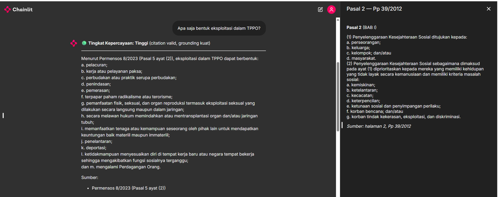
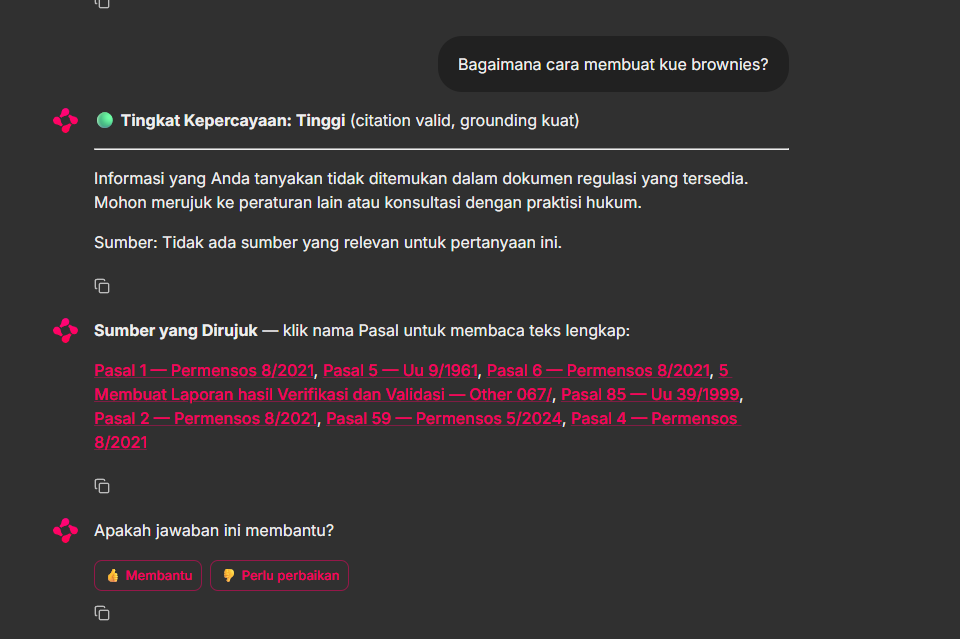

# Patih — Regulatory Assistant for Indonesia's Ministry of Social Affairs

**Patih** answers natural-language questions about the Indonesian Ministry of Social
Affairs (*Kementerian Sosial*, *Kemensos*) regulatory corpus with **traceable,
article-level citations** — every factual claim points back to the article it came from
(e.g. *"(Pasal 5 ayat (2) huruf a)"*). It is built as a **citation-enforced Hybrid
Parent-Document RAG**, runs **locally on your laptop**, and is designed honestly for a
legal domain: if the answer is not in the corpus, it **refuses to answer** rather than
making one up.

The name "Patih" refers to a senior advisor in classical Javanese kingdoms — the persona
is "an expert assistant that helps you understand regulations".

| Answer with citation cards | Out-of-scope question → refusal |
|---|---|
|  |  |

---

## Features

- **Hybrid retrieval**: dense (multilingual-e5-large, ONNX, CPU) + sparse (BM25), fused
  with Reciprocal Rank Fusion — captures both meaning *and* the literal article number.
- **Parent-Document retrieval**: ranks small units (ayat/huruf) but answers with the whole
  unit (Pasal) — sharp ranking, complete context.
- **Multi-document** (22 documents, see below) with implicit routing plus *document-scoped*
  cross-reference resolution and an always-on definitions article (Pasal 1).
- **Citation enforcement & hallucination defence**: citation extraction + whitelist + two
  HalluGraph-style scorers (Entity-Grounding, Relation-Preservation); risky answers are
  flagged to a human-in-the-loop queue and given a 🟢/🟡/🔴 confidence badge.
- **Calibrated abstention**: refuses questions outside the corpus.
- **Bilingual ID/EN**: detects the language → translates the *query* (not the corpus) →
  article citations always stay in the original Indonesian.
- **Grows via a folder watcher**: drop a new document into the inbox and it is
  auto-ingested and indexed.

> **Privacy note — "local" is precise, not absolute.** The data, embeddings, retrieval,
> and indexes are all local and never leave the laptop. **One** step touches the network:
> the LLM call sends the *query* + the retrieved article text to a cloud provider
> (Groq/Gemini/etc.) over HTTPS. The corpus is public regulation, so this is low-risk —
> but keep it in mind if your query contains personal or confidential data. See
> `docs/patih_v3.pdf` §Privacy.

---

## Prerequisites

- **Python 3.11** (not 3.12+ — wheel compatibility).
- **[Poetry](https://python-poetry.org/docs/#installation)** ≥ 1.8.
- **~3 GB free disk** for the embedding model (downloaded and built locally).
- *(Optional)* **Tesseract OCR** + the `ind` language pack — only if you want to ingest
  scanned PDFs (Windows: <https://github.com/UB-Mannheim/tesseract/wiki>).

## Installation

```bash
# 1. Clone and enter the repo
git clone https://github.com/<USERNAME>/<REPO>.git
cd <REPO>

# 2. Install dependencies
poetry install

# 3. Build the local embedder (downloads multilingual-e5-large ~2.3 GB from HuggingFace,
#    then exports it to ONNX under models/. INT8; automatically falls back to FP32.)
poetry run python deploy/scripts/quantize_e5.py

# 4. Configure keys and settings
cp .env.example .env
#    Edit .env:
#      - Set  EMBEDDER_BACKEND=onnx
#      - Fill in at least ONE free LLM key (GROQ_API_KEY recommended as primary;
#        GEMINI/CEREBRAS/OPENROUTER optional as fallbacks). See comments in .env.example.

# 5. Build the indexes (Chroma + BM25) from the 22 already-parsed documents
poetry run python -m app.retrieval.indexer --rebuild
```

## Running

```bash
poetry run chainlit run app/ui/chainlit_app.py --port 8000
```

Open <http://localhost:8000>. The first query is slower (~7–9 s) because the embedding
model loads; subsequent queries are warm (~1.5–2.5 s).

Example questions:
- *Apa saja bentuk eksploitasi dalam TPPO?* → cites Permensos 8/2023.
- *Apa definisi anak?* → cites UU 35/2014 (Pasal 1 angka 1).
- *Apa itu hak asasi manusia?* → cites UU 39/1999.
- *Bagaimana cara membuat kue brownies?* → refused (out of scope).

## Adding documents

Start the watcher in a separate terminal, then **just drop a PDF** into
`data/raw/inbox/`:

```bash
poetry run python -m tools.inbox_watcher
```

The watcher ingests it, indexes incrementally, and moves the file to `data/raw/`
(failures are quarantined to `data/raw/failed/` with a reason). See
`data/raw/inbox/README.md`.

### How metadata is handled

Each document needs a small `<name>.pdf.meta.json` sidecar that records its identity and
routing — its `doc_id`, regulation type/number/year, and whether to treat it as an
article-based regulation or a free-form `reference` document (which is chunked by
section/page rather than by article). These facts cannot be reliably read from the PDF
body, so a sidecar is required.

You don't have to write it: **if a sidecar is missing, the watcher auto-generates one**
from the filename and first pages (reusing the same inference as
`tools/triage_pdfs.py` / `tools/generate_meta_sidecars.py`). The result is a best-effort
guess — it is flagged `"_provenance": { "auto_generated": true }` and, when the
number/year can't be resolved, `"needs_review": true`. **Review it** before relying on the
citation labels, since a wrong regulation number would mislabel citations.

For precise metadata, supply your own sidecar next to the PDF (it takes precedence over
auto-generation). A minimal sidecar for a regulation:

```json
{
  "doc_id": "permensos-8-2023",
  "title": "Permensos 8/2023",
  "nomor": "8",
  "tahun": 2023,
  "jenis_regulasi": "PERMENSOS",
  "judul_lengkap": "Peraturan Menteri Sosial Nomor 8 Tahun 2023",
  "tentang": "Penanganan Korban TPPO dan PMI Bermasalah"
}
```

For a free-form document (SOP, statistics, plan) use `"doc_type": "reference"` instead of
`jenis_regulasi`. To disable auto-generation and require explicit sidecars, run the watcher
with `--no-auto-meta`.

## Tests

```bash
poetry run pytest          # ~307 tests (unit + integration + golden)
```

---

## Bundled corpus (22 documents)

Shipped as parsed JSON under `data/parsed/` (the source of truth; the indexes are rebuilt
from it). **19 article-structured regulations** + **3 reference documents** (RPJMN, two
SOPs). Anchor document: **Permensos 8/2023** (human trafficking & distressed migrant
workers). It also includes, among others, UU 39/1999 (Human Rights), UU 35/2014 (Child
Protection), UU 13/2011 (Handling of the Poor), PP 39/2012, several Permensos, Perbup, and
a Permenkes. The full list with article counts is in `docs/patih_v3.pdf` §Current Corpus
Inventory.

## Documentation

- **`docs/patih_v3.pdf`** — the complete reference: theory (the RAG family, embeddings,
  BM25, RRF, legislation parsing, hallucination defence, evaluation metrics, a mathematical
  reference) + technical documentation (the seven-layer architecture, a component catalogue,
  the online/offline flows, free-tier economics, privacy & runbook, a build-from-scratch
  guide, and an annotated bibliography).
- **`ARCHITECTURE.md`** — a concise architecture overview.

## Cost & free-tier note

Patih is designed to run at **zero cost** for personal use: embedding/retrieval are local,
and generation uses free tiers. For reliable evaluation or a ~100-users/day target the free
tier is not enough (see `docs/patih_v3.pdf` §Free-Tier Economics) — budget ~$5/month
(Groq Dev or paid Gemini).

---

## Disclaimer

Patih is a **regulation-research aid, not a substitute for legal advice**. Its accuracy is
a calibrated target with human review, not a guarantee. Always verify a cited article
against the original regulation before relying on it for any decision.

## License

Not yet chosen. The regulation texts used as the corpus are public Indonesian government
documents. Add a `LICENSE` file before others reuse this project.
